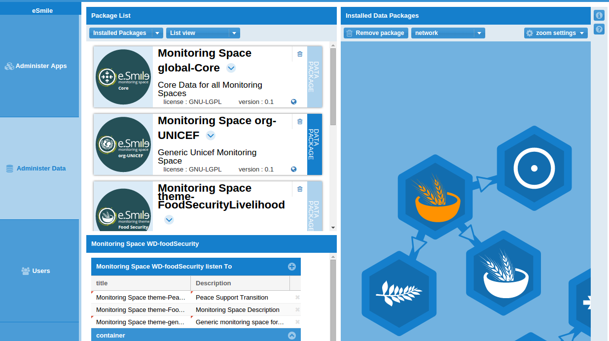

With e-smile, we wish to see more open, effective and transparent aid systems supporting sustainable and equitable development and engaging citizens not only as beneficiaries, but as actors of their own development.

Concretely, e-Smile is a series of plug-and-play applications combined together to build agile, open, coherent and contextualized information management and monitoring systems.

[see here for more information](https://www.e-smile.org/blog/e-smile/aboutE-Smile)

## Admin Application
The admin module - as the name suggests - allows e-smile global administration. It contains 4 components:
- Administration of installed Apps
- Administration of Monitoring Spaces
- Users and User Groups
- User Rights on available resources

### Administer Applications (Add, remove or update e-smile packages)

e-smile consists of a set of application modules that can be added, upgraded or removed, depending on the actual needs in terms of information management. The Administer Apps component is where this all happens.

### Administer Data
Data managed by the application follow the same patterns as applications : data also consists of packages that can be added, removed or modified.

This component guide the administrator to perfrom those tasks.

## Administer Users and User Groups
Add or remove users, and groups, decide who is belonging to which group and modify user and group metadata.

### User and User Groups Rights Decide who has access to which part of the data
Fine-grained control on who can access, modify or execute available resources.